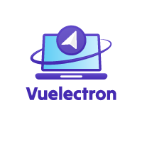

  

---

这是一个快速启动 **[Vite](https://vitejs.dev)** + **[Vue 3](https://vuejs.org)** + **[Electron](https://www.electronjs.org)** 项目基础模板

## 目前项目已经集成了：electron，vue3，vite，vue-router，pinia，eslint，pretter，UI框架vuetify，vue-i18n，数据库（nedb，sqlite）等功能

### 本地开发运行项目
1. git clone git@github.com:jx168/vue3-electron.git

2. cd vue3-electron

3. npm i 或者 yarn

4. npm run dev 或者 yarn dev

**安装依赖的过程中，若出现electron安装不了的，或者运行项目时报错提示：Electron failed to install correctly, please delete node_modules/electron and try installing again**

> 解决办法有2种，现在说一下我自己的解决办法（手动下载electron包）

**首先，查看package.json里的electron版本，然后去阿里镜像下载，如目前项目的electron版本为：30.0.1，对应的下载地址为：https://registry.npmmirror.com/-/binary/electron/30.0.1/electron-v30.0.1-win32-x64.zip**

**下载完后，在node_modules\electron\下创建dist文件夹。将下载的压缩包 解压 进刚刚创建的dist。然后在node_modules\electron\中创建path.txt，内容为electron.exe（对应自己的平台，不同平台不一样）。现在运行，已经可以正常启动了。**

---

### 打包生产

- 打包（这里以windows为例）
> npm run build:win 或者 yarn build:win

**若打包过程中，出现慢和卡顿问题，请往下看**

> 打包慢，是因为electron-builder打包，需要去github下载对应的包。比如本项目用的electron版本30.0.1。打包时，会去github下载对应的这个包。

- 解决办法也有2种，这里列举出一种。（一样是预先下载electron包）

- 我们可以预先下载这个包，放到本地缓存里。放的具体位置是：（下面以我的windows电脑为例子）**C:\Users\Administrator\AppData\Local\electron\Cache**。在Cache文件下，直接放入下载的v30.0.1文件就行，不用解压缩。

- 这样，打包时，就不需要去下载了。但还是需要下载 winCodeSign，nsis，nsis-resources,这三个，但是这三个的文件没有多大，所以不需要耗费多少时间。

---

- electron下载地址：https://registry.npmmirror.com/-/binary/electron/30.0.1/electron-v30.0.1-win32-x64.zip

- winCodeSign下载地址：https://github.com/electron-userland/electron-builder-binaries/releases/download/winCodeSign-2.6.0/winCodeSign-2.6.0.7z

